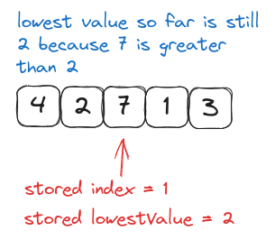

# A-Common-Sense-Guide-to-Data-Structures---Algorithms---Book-Notes

*This is my summary of **A Common Sense Guide to Data Structures And Algorithms, Second Edition** by Jay Wengrow. This summary helps me learn and serves as a quick reference. It does not replace the book, so I recommend buying and reading it if you want to understand the concepts better. Use this repository as a guide and a reference only.*

**Please send me a DM by [Twitter](https://twitter.com/akuoko_konadu) or [LinkedIn](https://www.linkedin.com/in/konaduakwasiakuoko-codedkaa/) if you are the publisher and you want this repository to be private. I will change the settings accordingly.**

Help the creator out by buying the book on [Amazon](https://www.amazon.com/Common-Sense-Guide-Structures-Algorithms-Second/dp/1680507222). Just to clarify I ain't getting any money by linking the book here.

**Contributions:** Issues, comments, and pull requests are welcome

This version here uses TypeScript. To go over to the Python version go [here](/Python/README.md).

---

## Table of Content

1. [Why Data Structures Matter](#1-why-data-structures-matter)
2. [Why Algorithms Matter](#2-why-algorithms-matter)
3. [Chapter 3](#3-chapter-3)
4. [Speeding Up Your Code With Big O](#4-speeding-up-your-code-with-big-o)
5. [Optimizing Code With or Without Big O](#5-optimizing-code-with-or-without-big-o)

---

## 1. Why Data Structures Matter

- **Data:** it refers to all types of information down to the most basic numbers and strings.
- **Data Structures:** it is how data is organized. It is the data in an array, int, set, string, etc.
- Organization of data doesn't just matter for organization sake, but it can significantly impact how fast your code runs.

### The Array: The Foundational Data Structure

Array is the most basic data structure in CS.

The size of an array is how many data elements the array holds.

The index of an array is the number that identifies where a piece of data lives inside the array.


### Data Structure Operations

To understand the performance of any data structure we need to analyze the common ways our code might interact with the data structure.

Many data structures are used in four main ways:

1. **Reading:** Looking something up at a **particular spot** within the data structure.
2. **Searching:** Looking for a **particular value** within a data structure.
3. **Inserting:** Adding a new value to the data structure.
4. **Deleting:** Removing a value from the data structure

### Measuring Speed

When measuring the speed of a code, we measure how fast an operation takes in terms of steps it takes, not the amount of time it takes.

If operation A takes 5 steps and operation B takes 500 steps to finish the same amount of taks, we say operation A is the fastest

#### Reading

In terms of reading from an array, it's one of the fastest operations. Because computers know how to jump to a specified index at anywhere in the array at any given time.

Reading fro an array is a very efficeint operation. Because computers can read any index by jumpint to the memory address in **one step**.

- **NB:** We can say that the worst case scenario from reading from an array is 1. Where 1 is the number of operations it takes.

#### Searching

Searching means providing the computer with a value, and asking it to return the index of that value's location.

Searching is tedious, since the computer has no way to jump to a particular value.

- **NB:** A computer has immediate access to all of it's memory addresses, but it has no idea offhand what values are contained at each memory address.

**Linear Search:** it is the type of searching where the computer checks each cell one at a time to find it's target value (the value you're searching for), and the target value's index.

> What is the maximum number of steps a computer would need to perform a linear search?

- For N number of cells in an array, linear search would take a maximum of N steps. Where **mostly N is the size of the array**.
- So this means that for a 500 array, in the work case scenario a linear search would tak up to 500 steps to find the index of an element you are looking for.
- And if by chance that element is not in the array, it'll need to check every cell in the array to make sure the value you are looking for is not in the array. And that is the worst case scenario for a linear search algorithm.

The following diagrams demonstrate the process the computer would use to
search for "elderberries" within our array:


**NB:** Searching is less efficient than reading. Since reading takes one step, and searching can take N steps (where N is the size of the array).

### Insertion

The efficiency of inserting a new piece of data into an array depends on where within the array you're inserting.

Insetting the value at the end of an array is the best time, and inserting it at they beginning is the worst time.

**Why?** As we've seen computers always know the size of an array, and the index which it begins. So inserting a value at the last place is just adding to the size of the array.

If the array begins at memory address 1010 and is of size 5, that means its final memory address is 1014. So, to insert an item beyond that would mean adding it to the next memory address, which is 1015. Once the computer calculates which memory address to insert the new value into, it can do so in one step.

But with insertion at the beginning or in the middle of an array is where the inefficiency lies. If you want to insert a new element at the beginning of an array all the elements must shift one side to the right for the array to have space to insert the new element.

*[Picture of Inserting at the beginning of an array]*

This means that some of the values were shifted to the right to make room for the `figs`.

The worst case scenario for insertion into an array is when we insert data at the beginning of the array. This is because when inserting at the beginning of the array, we have to move all the other values one cell to the right. So we can say that the worst case scenario is **`N+1`** for an array containing `N` elements.

### Deletion

Deletion from an array is the process of elimination the value at a particular index.

Like insertion, the worst case scenario of deleting an element is deleting the very first element of the array, because now we would need to shift all values to the next left cell.

But we can say that, for an an array containing `N` elements the maximum number of steps a deletion take is **`N`** steps.

### Sets

A set is another data structure just like an array but it does not allow you to duplicate data.

Reading, searching, and deletion operations on sets is the same as it is on arrays.

But insertion is where it works differently. When inserting into a set, the set would need to do a search first (which is N, where N is the size of the array). Only is the set does not yet contain our new value is when the set would insert it.

So for the worst case scenario, it is inserting a value at the beginning of a set. The set would search it's values (N) then if the value is not found in the array, it would shift all array values to the immediate right cell (which is also N, thus it takes N steps, where N is the size of the array). After the shift has been done, it inserts the value at the beginning of the set (which also takes 1 operation). Thus we can say that the worst time of inserting into a set is **`1+2N`**. Where `2N = 1st N (Searching the array) + 2nd N (Shifting all values to the immediate right cell)`.

### Wrapping Up

Analyzing the number of steps an operation takes is the heart of understanding the performance of data structures.

## 2. Why Algorithms Matter

### I'll fill in the blanks here

## 3. Chapter 3

### I'll fill in the blanks here 2

## 4. Speeding Up Your Code with Big O

### I'll fill in the blanks here 3

### A Linear Solution

Let's talk about a clever method to find duplicate numbers in a list of numbers without relying on nested loops. Imagine you have a list like `[3, 5, 8]`, and you want to check if there are any duplicate numbers in it. This solution is linear, thus `O(N)`.

```javascript
function hasDuplicateValue(array) {
  let steps = 0;
  let existingNumbers = [];
  for (let i = 0; i < array.length; i++) {
    steps++;
    if (existingNumbers[array[i]] === 1) {
      return true;
    } else {
      existingNumbers[array[i]] = 1;
    }
  }
  console.log(steps);
  return false;
}
```

- If we run hasDuplicateValue([1, 4, 5, 2, 9]) now, we’ll see that the output in the
JavaScript console is 5, which is the same as the size of our array. We’d find
this to be true across arrays of all sizes. This algorithm, then, is O(N).

#### How It Works

1. First, you create an empty list called `existingNumbers`.
2. Then, you loop through each number in your original list (array) one by one.
3. As you go through the numbers, you place a special marker (we'll use the number 1) in the `existingNumbers` list at the position that corresponds to the number you're examining.

For example:

- When you encounter the number 3, you put a 1 at position 3 in `existingNumbers`. It looks like this: `[undefined, undefined, undefined, 1]`.
- When you encounter the number 5, you put a 1 at position 5 in `existingNumbers`. It becomes: `[undefined, undefined, undefined, 1, undefined, 1]`.
- Finally, when you check the number 8, you put a 1 at position 8 in `existingNumbers`. It ends up like this: `[undefined, undefined, undefined, 1, undefined, 1, undefined, undefined, 1]`.

#### The Trick

Before placing a 1 in the `existingNumbers` list, you check if there's already a 1 at that position. If there is, it means you've already encountered that number before, and that's a duplicate! You then stop and say, "Hey, I found a duplicate!" If you finish checking all the numbers without finding any duplicates, you conclude, "Nope, no duplicates here."

#### Efficiency

This method is clever because it only needs to loop through the numbers once. The number of steps it takes is roughly the same as the number of numbers you have. For instance, if you have 5 numbers, it takes about 5 steps. We call this "linear time" or O(N) efficiency. It's an efficient way to find duplicates in a list!

### Wrapping Up

A strong grasp of Big O Notation helps you recognize sluggish code and choose faster algorithms among options. Yet, there are cases where Big O Notation wrongly suggests two algorithms are equally fast when one is truly quicker. In the upcoming chapter, you'll discover how to assess algorithm efficiencies, even when Big O falls short in providing nuanced insights.

## 5. Optimizing Code With or Without Big O

Big O Notation is a useful tool for comparing algorithms and choosing the best one for a situation. However, sometimes two algorithms may have the same Big O, but one is faster than the other.

## 5. Optimizing Code With or Without Big O

Big O Notation is a useful tool for comparing algorithms and choosing the best one for a situation. However, sometimes two algorithms may have the same Big O, but one is faster than the other.

### Selection Sort

Selection Sort is a sorting algorithm that works by finding the smallest value in an array and swapping it with the first element, then repeating the process for the remaining elements until the array is sorted. This is the steps to perform a selection sort algorithm:

  1. Iterate through the array from left to right, and identify the smallest value encountered in the array, store the smallest value's index in a variable. If we find a value smaller than the one indexed, we update the index to the new lowest value.
  
  2. After identifying the index with the lowest value, we exchange that value with the value at the starting index of the current pass. For instance, in the first pass-through we started at index 0, this involves swapping the lowest value with the value at index 0. in the second pass through we will start at index 1, so the smallest value would be swapped with the value at index 1, and in the third pass through we will start at index 2, it would be swapped with the value at index 2. Essentially, in each pass-through, the smallest value found is moved to the corresponding position based on the pass number.
  
  3. Repeat step 1 and step 2 until we reach a pass-through that would start at the end of the array. By then the array would have been fully sorted.

### Selection Sort in Action

A walk through of the steps of Selection Sort using this example array: `[4, 2,
7, 1, 3]`.

#### First passthrough

We begin by inspecting the value at index 0, which, being the only value encountered so far, is considered the lowest so we store its index in a variable.


1. We compare the 2 with the lowest value so far (which happens to be 4), now 2 is less than 4. So the lowest value is now 2, we then store its value 2 and its index value 1:


2. We compare the next value 7 with the lowest value 2. 7 is greater than 2, so 2 stays our lowest value:

