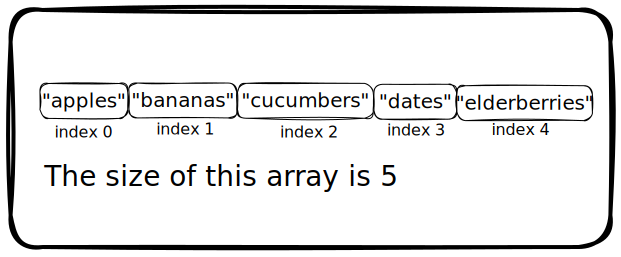

# A-Common-Sense-Guide-to-Data-Structures---Algorithms---Book-Notes

*This is my summary of **A Common Sense Guide to Data Structures And Algorithms, Second Edition** by Jay Wengrow. This summary helps me learn and serves as a quick reference. It does not replace the book, so I recommend buying and reading it if you want to understand the concepts better. Use this repository as a guide and a reference only.*

**Please send me a DM by [Twitter](https://twitter.com/akuoko_konadu) or [LinkedIn](https://www.linkedin.com/in/konaduakwasiakuoko-codedkaa/) if you are the publisher and you want this repository to be private. I will change the settings accordingly.**

Help the creator out by buying the book on [Amazon](https://www.amazon.com/Common-Sense-Guide-Structures-Algorithms-Second/dp/1680507222). Just to clarify I ain't getting any money by linking the book here.

**Contributions:** Issues, comments, and pull requests are welcome

---

## Table of Content

1. [Why Data Structures Matter](#1-why-data-structures-matter)
2. Why Algorithms Matter

---

## 1. Why Data Structures Matter

- **Data:** it refers to all types of information down to the most basic numbers and strings.
- **Data Structures:** it is how data is organized. It is the data in an array, int, set, string, etc.
- Organization of data doesn't just matter for organization sake, but it can significantly impact how fast your code runs.

### The Array: The Foundational Data Structure

- Array is the most basic data structure in CS.
- The size of an array is how many data elements the array holds.
- The index of an array is the number that identifies where a piece of data lives inside the array.

### Data Structure Operations

To understand the performance of any data structure we need to analyze the common ways our code might interact with the data structure.

Many data structures are used in four main ways:

1. **Reading:** Looking something up at a **particular spot** within the data structure.
2. **Searching:** Looking for a **particular value** within a data structure.
3. **Inserting:** Adding a new value to the data structure.
4. **Deleting:** Removing a value from the data structure

### Measuring Speed

When measuring the speed of a code, we measure how fast an operation takes in terms of steps it takes, not the amount of time it takes.

If operation A takes 5 steps and operation B takes 500 steps to finish the same amount of taks, we say operation A is the fastest

#### Reading

In terms of reading from an array, it's one of the fastest operations. Because computers know how to jump to a specified index at anywhere in the array at any given time.

Reading fro an array is a very efficeint operation. Because computers can read any index by jumpint to the memory address in **one step**.

- **NB:** We can say that the worst case scenario from reading from an array is 1. Where 1 is the number of operations it takes.
